# ER MODEL

> **Referensi** : [Link Video Kuliah ER MODEL](https://youtube.com/playlist?list=PLoJAIIF7j9weUPGKl_0r3aEAalkurlXOH)

## 1. Intro

#### A. Design Phases

1. Initial phase (req. user)
2. Second phase (choosing a data model (ER DIAGRAM))
3. Final phase (nsert to DBMS)

#### B. Design Alternatives
avoid:  
1. Redundancy (atribut berulang)
2. Incompleteness (mau insert atribut baru)

#### C. Design Approaches

1. Entity Relationship Model
2. Normalization Theory (Next topic)

## 2. Entity & Relationship

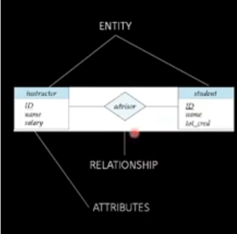
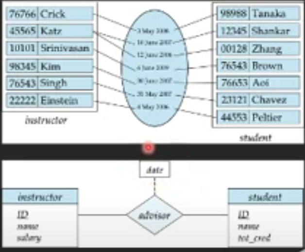
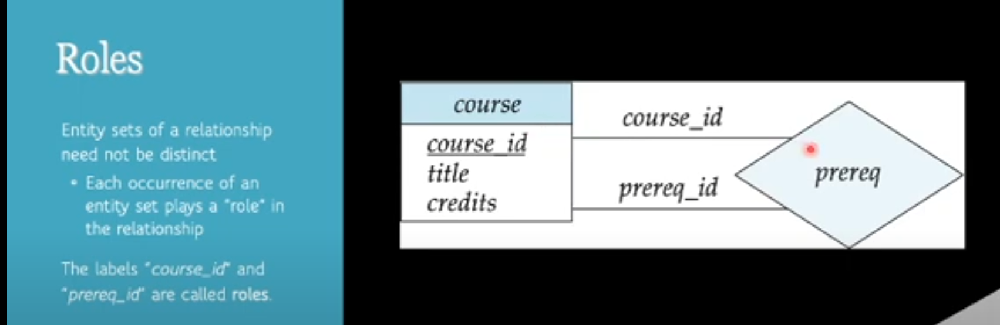

## 3. Degree of Relationship Set

1. Binary relationship (2 entity)
2. Non-binary relationship/Ternary relationship ( >2 entity)
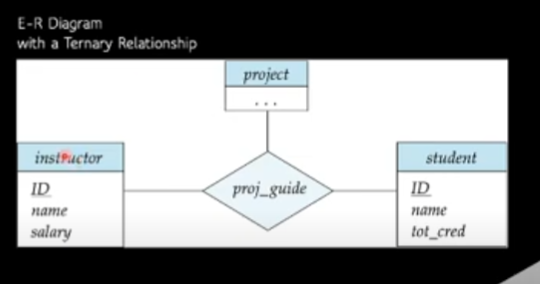

## 4. Complex Attributes

1. Simple
2. Composite
3. Multivalued
4. Derived  

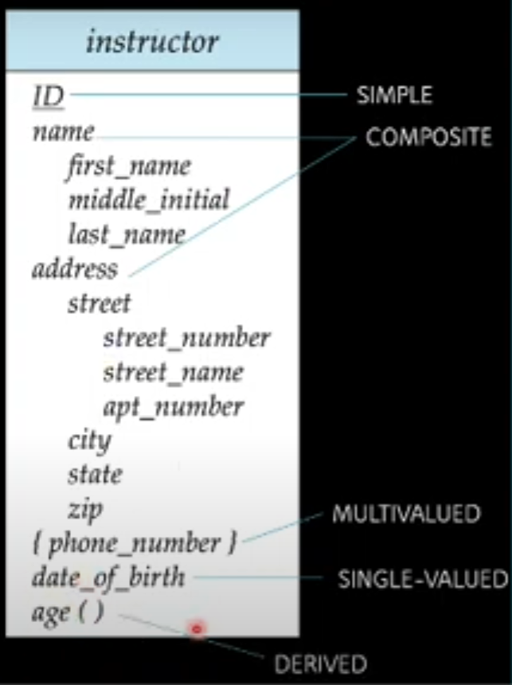

## 5. Mapping Cardinality

1. One to one
2. One to many
3. Many to one
4. Many to many  

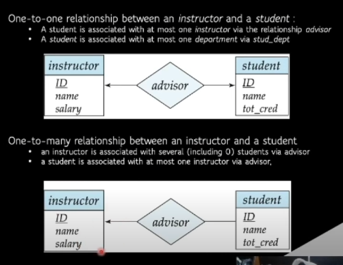

## 6. Total & Partial Participations

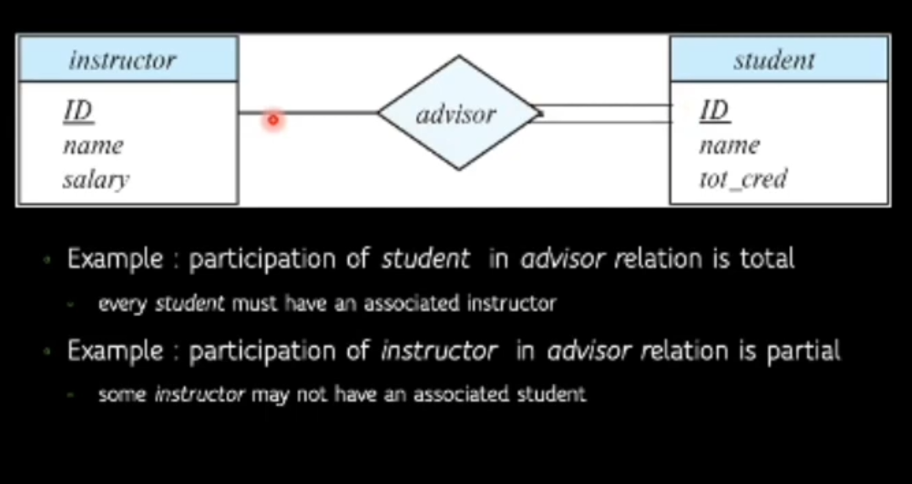

Tenary cuma boleh cuma 1 arrow

## 7. Primary Key

Primary key di relationship sets:  
1. Many-to-many: PK gabungan
2. One-to-many: PK diambil dari si "Many"
3. many-to-one: PK diambil dari si "Many"
4. One-to-one: PK diambil dari salah satu

## 8. Weak Entity
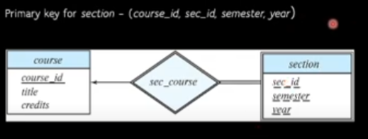

## 9. Redundant Attributes

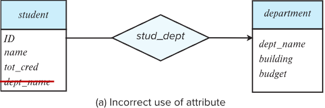

## 10. Specialization & Generalization

Specialization (top-down):
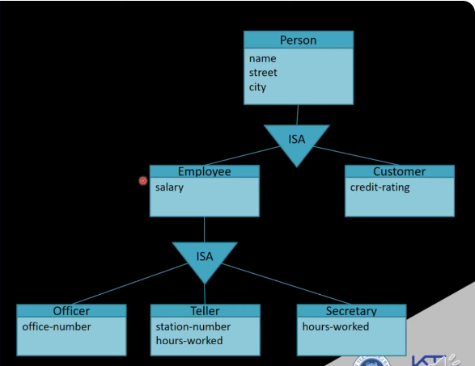

Generalization(bottom-up):
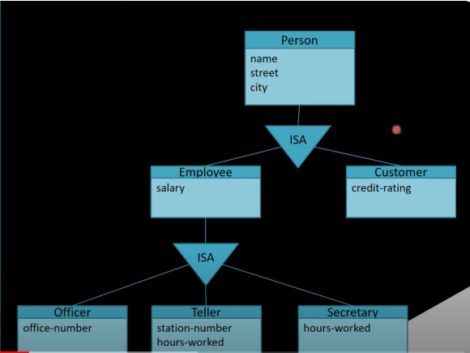

Design Constraints:
1. Condition-defined OR user-defined
2. Disjoint OR overlapping
3. Total OR partial
   
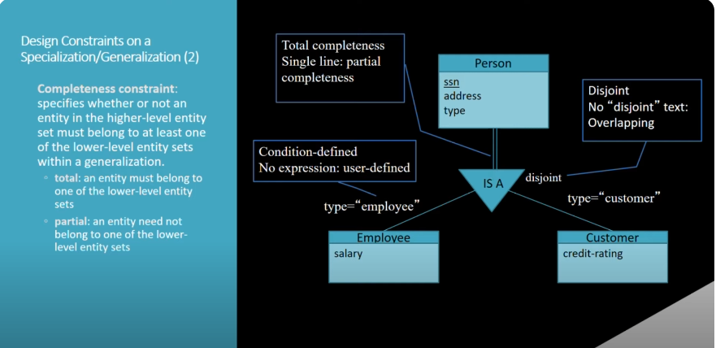

## 11. Aggregation

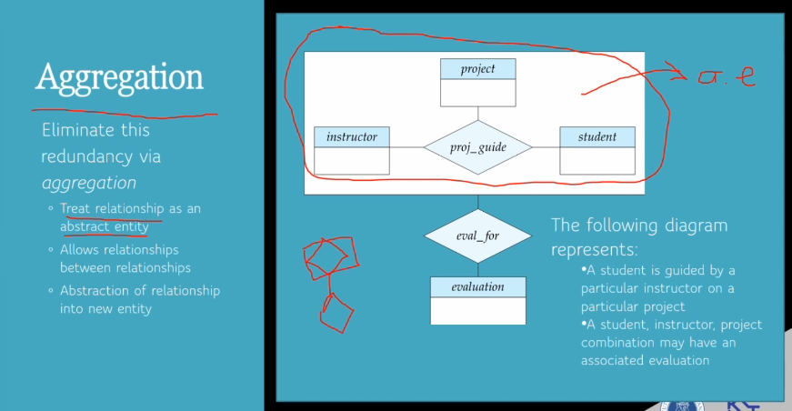

## 12. Design Issue

1. Redundant: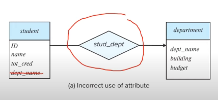
2. Multivalued: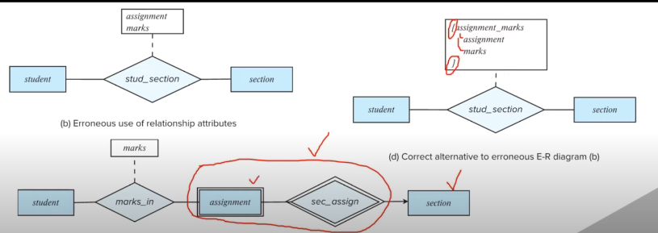
3. Entity or attribute?: 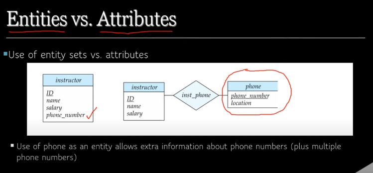
4. Entity or realtionship sets?: 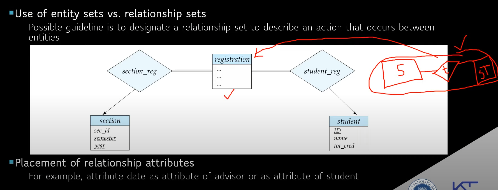
5. Decisions: 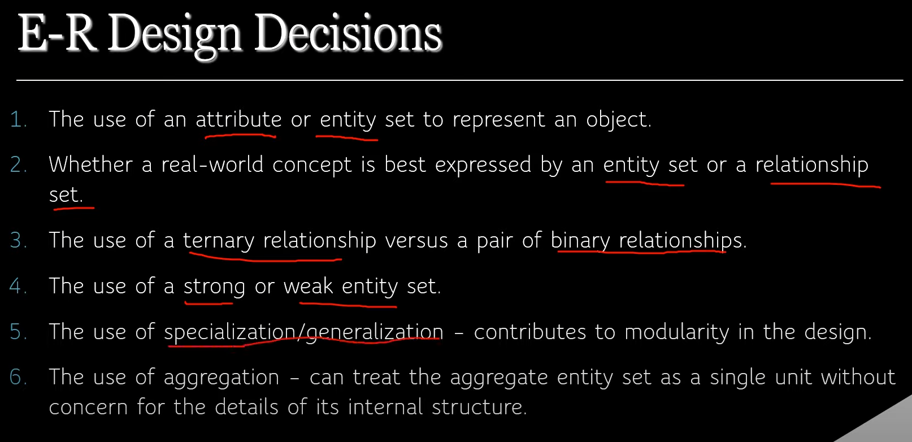
6. Symbols: 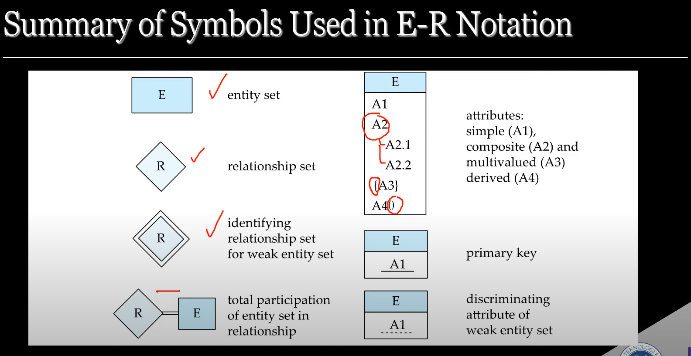 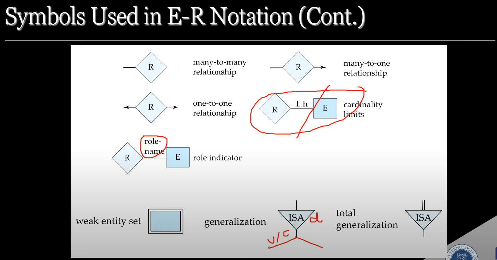
   